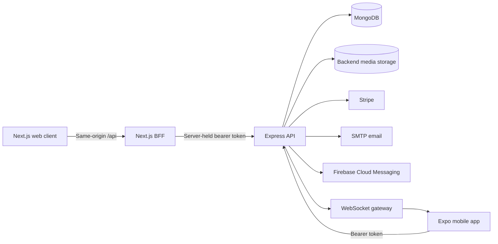

<p align="center">
  
</p>

<h1 align="center">Rentora</h1>

<p align="center">
  A full-stack property maintenance and operations platform for landlords, tenants, and service vendors.
</p>

<p align="center">
  <strong>Next.js</strong> | <strong>React Native / Expo</strong> | <strong>Express</strong> | <strong>TypeScript</strong> | <strong>MongoDB</strong>
</p>

## Overview

Rentora brings the complete maintenance workflow into one organization-scoped system. Tenants report issues for their assigned units, landlords coordinate properties and vendors, and vendors progress assigned work through a controlled request lifecycle.

The repository contains three applications backed by one domain model:

- A responsive **Next.js web dashboard** for property operations.
- A role-aware **Expo React Native application** for landlords, tenants, and vendors.
- An **Express and MongoDB API** responsible for authorization, workflow rules, notifications, media, and subscriptions.

This project demonstrates product-focused full-stack engineering across responsive UI, native mobile workflows, API design, authentication, multi-tenant authorization, background jobs, and third-party integrations.

## Product Capabilities

### Landlords

- Monitor portfolio and maintenance statistics from an operational dashboard.
- Manage organizations, properties, units, tenants, and vendors.
- Search and filter maintenance requests by status, urgency, property, vendor, and date.
- Assign vendors, review completed work, and verify requests.
- Invite vendors and create tenant accounts with unit assignments.
- Manage subscription state, organization details, profile media, and notification preferences.

### Tenants

- Access only their assigned property and unit context.
- Create maintenance requests with urgency, descriptions, and supporting images.
- Track request progress from submission through verification.
- Receive status, assignment, lease, and account notifications.

### Vendors

- View only requests assigned to their active vendor profile.
- Move work through the permitted `ASSIGNED -> IN_PROGRESS -> DONE` lifecycle.
- Upload completion evidence and maintain service categories.
- Receive new-assignment and vendor-account notifications.

## Engineering Highlights

### Multi-tenant authorization

Every protected resource is scoped to an organization. Role middleware and domain services enforce landlord, tenant, and vendor permissions on the server, including valid request transitions and ownership checks.

### Secure web authentication

The browser communicates with a same-origin Next.js Backend-for-Frontend (BFF). Backend access and refresh tokens are stored inside an AES-256-GCM encrypted HttpOnly cookie rather than browser storage. The BFF provides:

- Explicit route and method allowlisting.
- Server-side token refresh with one retry.
- CSRF origin and custom-header checks for mutations.
- Credential and debug-field removal from browser-facing responses.
- Session and persistent "Remember me" modes with absolute expiry.
- Same-origin media proxying and strict upload limits.

The mobile application keeps its native bearer-token contract and stores credentials through its dedicated authentication layer.

### Event-driven notifications

Domain events create organization-scoped notification records, broadcast WebSocket updates, and optionally send Firebase Cloud Messaging pushes. The implementation includes:

- Actor exclusion and recipient deduplication.
- Persisted per-user preferences.
- Idempotency keys for scheduled events and webhook retries.
- Request, lease, account, vendor, invitation, and subscription events.
- Daily email digests and notification retention jobs.
- Non-blocking delivery so notification failures do not roll back business actions.

### Production-minded API design

- Helmet security headers, CORS allowlisting, rate limiting, and payload sanitization.
- Short-lived JWT access tokens with persisted refresh-token revocation.
- Stripe checkout and signature-verified webhook handling.
- Searchable, categorized backend media storage excluded from version control.
- Graceful process shutdown and configurable MongoDB connection pooling.
- Destructive account/property operations clean up related domain records.

## Architecture



The API remains the source of truth for identity, organization membership, subscriptions, request transitions, and recipient selection. Client-side role checks improve navigation but are never treated as authorization.

## Technology Stack

| Area | Technologies |
| --- | --- |
| Web | Next.js 16 App Router, React 19, TypeScript, Tailwind CSS 4 |
| Mobile | Expo 55, React Native 0.83, React Navigation, Redux Toolkit, Redux Persist |
| Backend | Node.js, Express 5, TypeScript, Mongoose |
| Data | MongoDB |
| Authentication | JWT access/refresh tokens, encrypted HttpOnly web sessions, bcrypt |
| Realtime | Native WebSockets, Firebase Cloud Messaging, Expo Notifications |
| Integrations | Stripe, Nodemailer/SMTP, Firebase Admin |
| Quality | ESLint, TypeScript builds, Node test runner, BFF security tests |

## Request Workflow

```text
NEW -> ASSIGNED -> IN_PROGRESS -> DONE -> VERIFIED
```

- Tenants create requests only for themselves and their assigned unit.
- Landlords assign vendors and perform final verification.
- Vendors update only work assigned to their own active vendor profile.
- Invalid role actions and invalid status transitions are rejected by the backend.

## Repository Structure

```text
Rentora/
|-- backend/   Express API, domain services, jobs, models, and tests
|-- mobile/    Expo application with role-specific navigation and state
|-- web/       Next.js dashboard, BFF, session layer, and UI features
`-- docs/      Architecture, design, session, and notification documentation
```

## Local Setup

### Prerequisites

- Node.js 20 or newer
- npm
- MongoDB
- Optional credentials for Stripe, SMTP, and Firebase push notifications

### 1. Backend

```bash
cd backend
npm install
```

Create `backend/.env`:

```dotenv
PORT=5000
MONGO_URI=mongodb://127.0.0.1:27017/rentora
JWT_SECRET=replace-with-a-strong-secret
JWT_EXPIRES_IN=15m
REFRESH_TOKEN_EXPIRES_IN=30d
CORS_WHITELIST=http://localhost:3000,http://localhost:8081

# Optional integrations
STRIPE_SECRET_KEY=
STRIPE_WEBHOOK_SECRET=
SMTP_HOST=
SMTP_PORT=587
SMTP_USER=
SMTP_PASS=
SMTP_FROM=
FIREBASE_SERVICE_ACCOUNT_PATH=
```

Start the API:

```bash
npm run dev
```

To populate a disposable development database with role-based demo data:

```bash
npm run seed:data
```

### 2. Web dashboard

```bash
cd web
npm install
openssl rand -hex 32
```

Create `web/.env` using the generated session secret:

```dotenv
BACKEND_API_URL=http://localhost:5000/api
BFF_SESSION_SECRET=<64-character-hex-value>
```

Then start Next.js:

```bash
npm run dev
```

The dashboard is available at [http://localhost:3000](http://localhost:3000).

### 3. Mobile application

```bash
cd mobile
npm install
```

Create `mobile/.env` with an API address reachable by the emulator or physical device:

```dotenv
EXPO_PUBLIC_API_URL=http://<your-lan-ip>:5000/api
```

Run the application:

```bash
npm start
# or
npm run android
npm run ios
```

## Verification

Run the focused backend and web checks before shipping changes:

```bash
cd backend
npm test

cd ../web
npm run lint
npm run test:bff
npm run build
```

The backend suite covers notification delivery rules and authentication/session regressions. The BFF suite exercises cookie integrity, CSRF protection, route allowlisting, refresh behavior, logout, account deletion, media proxying, and protected notification operations.

## Documentation

- [Project context and domain behavior](./docs/PROJECT_CONTEXT.md)
- [Web sessions and BFF security](./docs/WEB_SESSIONS.md)
- [Notification architecture and event matrix](./docs/NOTIFICATIONS.md)
- [Web application plan](./docs/Rentora_Web_App_Plan.md)
- [Mobile SaaS plan](./docs/Rentora_Hybrid_Mobile_SaaS_Plan.md)
- [Design system](./docs/design.md)

## Current Direction

Rentora is under active development. The next engineering milestones are object-storage-backed request media, broader role-specific web workspaces, expanded automated coverage, and deployment automation.

---

Built as a portfolio-grade SaaS project to demonstrate thoughtful product design, secure full-stack architecture, and maintainable cross-platform engineering.
